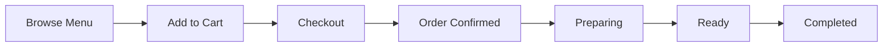

# Veg Delight - Restaurant Order System

<div align="center">


**A complete, production-ready 100% Vegetarian Restaurant Order Management System**

[Features](#-features) • [Installation](#-installation) • [Usage](#-usage) • [Tech Stack](#-tech-stack) • [Contributing](#-contributing)

</div>

---

## Overview

**Veg Delight** is a full-featured restaurant order management system designed specifically for vegetarian restaurants. Built with ASP.NET MVC (.NET Framework 4.8), it provides a complete solution for managing menus, processing orders, and tracking restaurant operations with Indian Rupee (₹) pricing.

### Key Highlights

- 🌿 **Pure Vegetarian Menu** - Curated Indian vegetarian cuisine
- 🛒 **Online Ordering** - Complete shopping cart with checkout
- 📱 **Responsive Design** - Works on desktop, tablet, and mobile
- 👨‍💼 **Admin Dashboard** - Comprehensive restaurant management
- 📊 **Order Tracking** - Real-time status updates via email

---

## Features

### Customer Features

| Feature | Description |
|---------|-------------|
| **Browse Menu** | View dishes organized by categories with images and descriptions |
| **Shopping Cart** | Add items, update quantities, and manage orders |
| **Checkout** | Simple checkout process with customer details |
| **Order Tracking** | Track order status by email |
| **Featured Items** | Discover chef's special dishes |
| **Free Delivery** | Free delivery on orders above ₹500 |

### Admin Features

| Feature | Description |
|---------|-------------|
| **Dashboard** | Overview of sales, orders, and restaurant metrics |
| **Menu Management** | Add, edit, delete menu items and categories |
| **Order Management** | View, update, and track all orders |
| **Status Updates** | Update order status (Pending → Confirmed → Preparing → Ready → Completed) |
| **Reports** | Track daily revenue and popular items |

### Sample Menu

| Category | Item | Price |
|----------|------|-------|
| **Appetizers** | Paneer Tikka ⭐ | ₹280 |
| **Main Course** | Vegetable Biryani ⭐ | ₹320 |
| **Main Course** | Dal Makhani ⭐ | ₹240 |
| **Main Course** | Palak Paneer | ₹260 |
| **Breads** | Butter Naan | ₹60 |
| **Beverages** | Masala Chai | ₹40 |
| **Desserts** | Gulab Jamun | ₹120 |

> ⭐ Featured/Chef's Special items

---

## Tech Stack

### Backend
- **ASP.NET MVC 5** - Web application framework
- **C# (.NET Framework 4.8)** - Primary programming language
- **ADO.NET** - Database operations
- **SQL Server** - Database management

### Frontend
- **Bootstrap 5** - Responsive CSS framework
- **jQuery 3.7** - JavaScript library
- **Font Awesome** - Icons
- **HTML5 & CSS3** - Markup and styling

### Architecture
```
RestaurantOrderSystem/
├── Controllers/        # MVC Controllers
│   ├── HomeController.cs
│   ├── MenuController.cs
│   ├── CartController.cs
│   ├── OrderController.cs
│   ├── AdminController.cs
│   └── LoginController.cs
├── Models/             # Data Models
│   ├── MenuItem.cs
│   ├── Category.cs
│   ├── Order.cs
│   ├── OrderDetail.cs
│   └── ShoppingCart.cs
├── Views/              # Razor Views
├── Data/               # Database Context & Initializer
├── Scripts/            # JavaScript files
└── Content/            # CSS and Images
```

---

## Installation

### Prerequisites

- **Visual Studio 2019/2022** (with ASP.NET and web development workload)
- **SQL Server** (Express or higher) or **LocalDB**
- **.NET Framework 4.8** SDK

### Quick Start

1. **Clone the repository**
   ```bash
   git clone https://github.com/Hemil195/Delight-Restaurant.git
   cd Delight-Restaurant
   ```

2. **Open in Visual Studio**
   - Open `RestaurantOrderSystem.sln`

3. **Configure Database Connection**
   - Update `Web.config` with your SQL Server connection string:
   ```xml
   <connectionStrings>
     <add name="DefaultConnection"
          connectionString="Data Source=YOUR_SERVER;Initial Catalog=ROS;Integrated Security=True;Encrypt=False"
          providerName="System.Data.SqlClient" />
   </connectionStrings>
   ```

4. **Build the Solution**
   - Go to `Build → Rebuild Solution` (or press `Ctrl+Shift+B`)

5. **Run the Application**
   - Press `F5` or `Ctrl+F5`
   - Navigate to `https://localhost:44300/`

> 💡 **Note:** The database is automatically initialized with sample menu items on first run.

---

## Usage

### Key Pages

| Page | URL | Description |
|------|-----|-------------|
| **Home** | `/` | Welcome page with featured items |
| **Menu** | `/Menu` | Browse all dishes by category |
| **Cart** | `/Cart` | View and manage shopping cart |
| **Checkout** | `/Order/Checkout` | Complete your order |
| **Order Tracking** | `/Order/Track` | Track order by email |
| **Admin Dashboard** | `/Admin/Dashboard` | Restaurant management panel |

### Order Workflow



### Admin Login

Access the admin panel to manage your restaurant:
- Navigate to `/Login`
- Use admin credentials to access the dashboard

---

## Configuration

### Customization Options

- **Restaurant Branding**: Update restaurant name and logo in views
- **Menu Items**: Add/modify items through Admin panel or database
- **Pricing**: All prices are in Indian Rupees (₹)
- **Delivery Charges**: Free delivery above ₹500 (configurable)
- **Categories**: Add new food categories as needed

### Database Schema

```sql
-- Main Tables
- Categories (CategoryID, Name, Description, ImageUrl)
- MenuItems (ItemID, Name, Price, Description, CategoryID, IsAvailable, IsFeatured)
- Orders (OrderID, CustomerName, CustomerEmail, CustomerPhone, TotalAmount, Status)
- OrderDetails (OrderDetailID, OrderID, ItemID, Quantity, UnitPrice, Subtotal)
```

---

## Contributing

Contributions are welcome! Here's how you can help:

1. **Fork** the repository
2. **Create** a feature branch (`git checkout -b feature/AmazingFeature`)
3. **Commit** your changes (`git commit -m 'Add some AmazingFeature'`)
4. **Push** to the branch (`git push origin feature/AmazingFeature`)
5. **Open** a Pull Request

### Ideas for Contribution

- [ ] Add payment gateway integration
- [ ] Implement user authentication for customers
- [ ] Add email notifications for order updates
- [ ] Create a mobile app companion
- [ ] Add multi-language support
- [ ] Implement table reservation system

---

## Additional Resources

- **Windows Forms Version**:  See `/RestaurantOrderSystem/WindowsFormsVersion/` for a desktop application variant
- **Setup Scripts**: Check `Setup_WindowsForms.bat` for alternative setup options

---

## License

This project is open source and available for educational and personal use.


